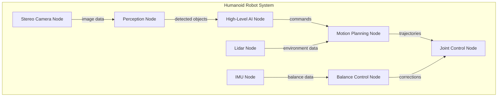

# What Is ROS 2 and Why It Matters for Humanoid Robotics

## Learning Objectives

- Understand the fundamental concepts of ROS 2 as a middleware system
- Recognize the importance of ROS 2 for humanoid robotics applications
- Identify the key components that make ROS 2 suitable for complex robotic systems
- Appreciate how ROS 2 enables the integration of AI and physical robotics

## Introduction to ROS 2 as the Robotic Nervous System

ROS 2 (Robot Operating System 2) serves as the foundational middleware that connects all components of a robotic system, functioning much like a nervous system in biological organisms. For humanoid robots, which require sophisticated coordination between numerous sensors, actuators, and AI systems, ROS 2 provides the essential communication backbone that enables seamless integration and operation.

In the context of humanoid robotics, ROS 2 is particularly valuable because it addresses the complex challenges of:

- **Multi-component coordination**: Managing communication between dozens of sensors, actuators, and processing units
- **Real-time constraints**: Ensuring timely delivery of critical control signals
- **Distributed computing**: Supporting computation across multiple processors and computers
- **Safety and reliability**: Providing fault tolerance and error handling for complex systems

### The Evolution from ROS 1 to ROS 2

ROS 2 represents a significant evolution from the original ROS framework, addressing critical limitations that prevented widespread adoption in commercial and safety-critical applications:

1. **Quality of Service (QoS) policies**: Allow fine-tuning of communication reliability and performance
2. **Real-time support**: Better deterministic behavior for time-critical operations
3. **Security features**: Authentication, encryption, and access control for secure operations
4. **Improved architecture**: Better support for distributed systems and multiple robots
5. **Enhanced tooling**: Better debugging, visualization, and profiling tools

For humanoid robotics, these improvements are crucial because humanoids operate in dynamic environments where reliability, safety, and real-time performance are paramount.

## Core Architecture of ROS 2

ROS 2's architecture is built around the Data Distribution Service (DDS) standard, which provides a publish-subscribe communication model with additional features for robotics applications. The core components include:

### Nodes
Nodes are the fundamental computational units in ROS 2. Each node represents a process that performs a specific function, such as sensor processing, control, or planning. In a humanoid robot, you might have nodes for:

- Joint controllers
- Sensor data processing
- Perception systems
- Motion planning
- High-level AI reasoning
- User interface

### Topics and Services
Communication in ROS 2 occurs through two primary mechanisms:

- **Topics**: Asynchronous, many-to-many communication using a publish-subscribe model. Ideal for continuous data streams like sensor readings, camera feeds, or joint positions.
- **Services**: Synchronous, request-response communication for discrete operations like changing parameters or requesting specific computations.

### Actions
Actions provide a more sophisticated communication pattern for long-running tasks with feedback and goal management. This is particularly important for humanoid robotics where tasks like walking, grasping, or navigation may take significant time and require ongoing status updates.

## ROS 2 for Humanoid Robotics: Specific Benefits

Humanoid robots present unique challenges that make ROS 2 particularly valuable:

### 1. Complex Sensor Integration
Humanoid robots typically have numerous sensors including:
- Multiple cameras for vision
- IMUs for balance and orientation
- Force/torque sensors in joints
- Touch sensors in hands and feet
- LiDAR for environment mapping

ROS 2's flexible communication patterns allow these sensors to be integrated and coordinated effectively.

### 2. Distributed Control Architecture
Humanoid robots often have distributed control systems where different processors handle different functions (e.g., vision processing on GPUs, control on real-time CPUs). ROS 2's distributed architecture supports this naturally.

### 3. Real-time Performance Requirements
Maintaining balance and responding to environmental changes requires real-time performance. ROS 2's QoS policies and real-time support help ensure critical messages are delivered on time.

### 4. Safety and Fault Tolerance
Humanoid robots operating in human environments must be safe and reliable. ROS 2's lifecycle nodes and monitoring tools help build robust systems.

## Practical Example: Humanoid ROS 2 Architecture

Consider a simple humanoid robot architecture:

In this architecture, each node performs a specific function but communicates with others through ROS 2's messaging system. The AI node receives environmental information from perception and lidar, plans motions, and sends commands to the motion planning and joint control nodes.

## Why ROS 2 Matters for Physical AI

ROS 2 serves as the bridge between high-level AI systems and physical robot hardware. For Physical AI applications:

1. **Abstraction**: Provides clean interfaces between AI algorithms and hardware control
2. **Standardization**: Uses standardized message types and interfaces that facilitate integration
3. **Scalability**: Supports everything from simple robots to complex multi-robot systems
4. **Community**: Large community and ecosystem of packages and tools
5. **Documentation**: Extensive documentation and learning resources

## Key Takeaways

- ROS 2 provides the middleware foundation that connects all components of a humanoid robot
- Its publish-subscribe architecture enables flexible, distributed systems
- Quality of Service policies ensure reliable communication for safety-critical applications
- ROS 2 bridges the gap between AI algorithms and physical robot control
- The framework is specifically designed to handle the complexity of humanoid robotics

## Next Steps

- Learn about ROS 2 installation and workspace setup
- Understand basic ROS 2 concepts like topics, services, and actions
- Practice creating simple ROS 2 nodes and communication patterns
- Explore ROS 2 tools for debugging and visualization

## References

- ROS 2 Documentation: https://docs.ros.org/en/humble/
- ROS 2 Design: https://design.ros2.org/
- ROS 2 Tutorials: https://docs.ros.org/en/humble/Tutorials.html